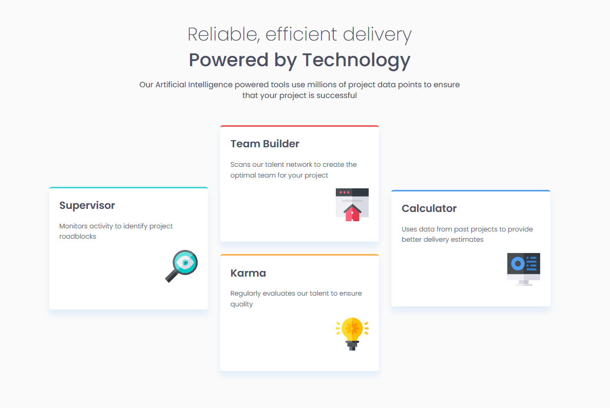
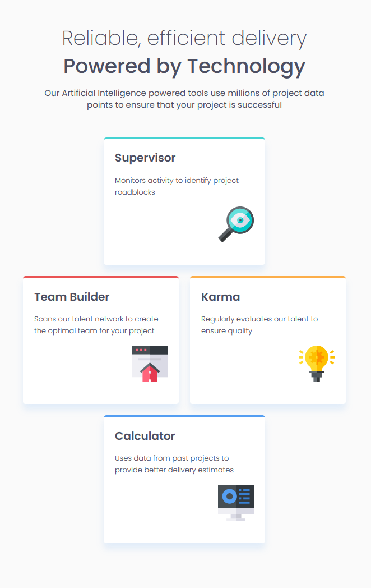
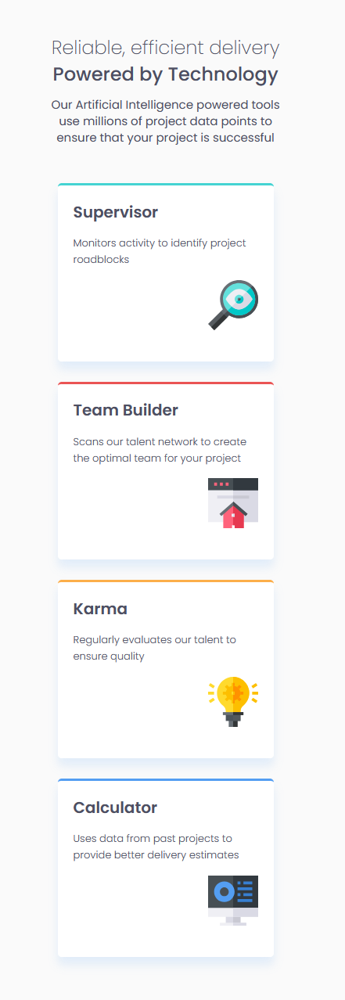

# Frontend Mentor - Four card feature section solution

This is a solution to the [Four card feature section challenge on Frontend Mentor](https://www.frontendmentor.io/challenges/four-card-feature-section-weK1eFYK).

## Table of contents

- [Overview](#overview)
  - [The challenge](#the-challenge)
  - [Screenshot](#screenshot)
  - [Links](#links)
- [My process](#my-process)
  - [Built with](#built-with)
- [Author](#author)

## Overview

### The challenge

Users should be able to:

- View the optimal layout for the site depending on their device's screen size

### Screenshot

Desktop:

Tablet:

Mobile:

### Links

- [Solution URL](https://github.com/bsd-rgb/Four-Card-Feature-Section)
- [Live Site URL](https://bsd-rgb.github.io/Four-Card-Feature-Section/)

## My process

### Built with

- HTML
- CSS
  - Grid
  - Flexbox

## Author

- Frontend Mentor - [@bsd-rgb](https://www.frontendmentor.io/profile/bsd-rgb)
